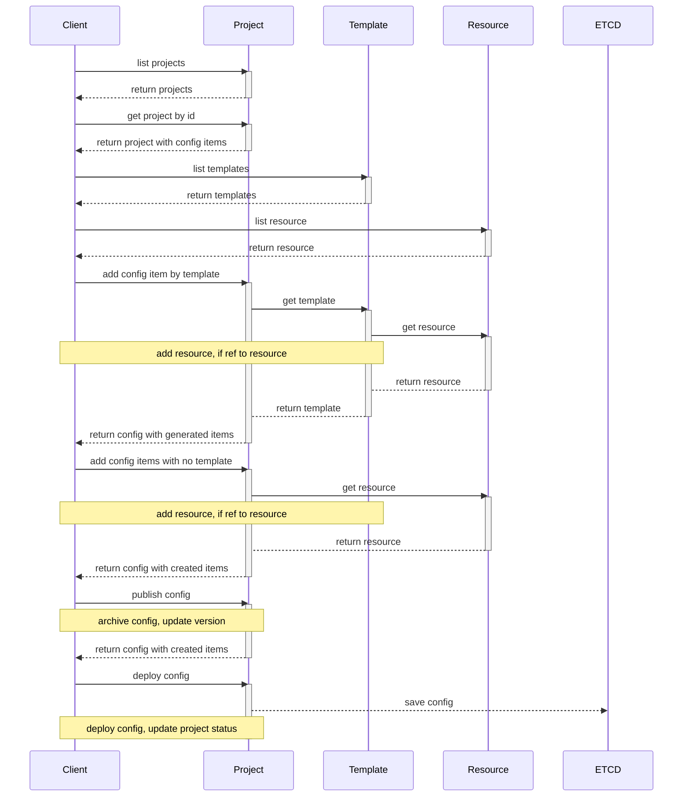

# confgo flow

```mermaid
sequenceDiagram
    Client ->> Project: list projects
    activate Project
    Project -->> Client: return projects
    deactivate Project

    Client ->> Project: get project by id
    activate Project
    Project -->> Client: return project with config items
    deactivate Project

    Client ->> Template: list templates
    activate Template
    Template -->> Client: return templates
    deactivate Template

    Client ->> Resource: list resource
    activate Resource
    Resource -->> Client: return resource
    deactivate Resource


    Client ->> Project: add config item by template
    activate Project
    Project ->> Template: get template
    activate Template
    Template ->> Resource: get resource
    activate Resource
    Note over Client, Template: add resource, if ref to resource
    Resource --> Template: return resource
    deactivate Resource
    Template --> Project: return template
    deactivate Template
    Project -->> Client: return config with generated items
    deactivate Project

    Client ->> Project: add config items with no template
    activate Project
    Project ->> Resource: get resource
    activate Resource
    Note over Client, Template: add resource, if ref to resource
    Resource --> Project: return resource
    deactivate Resource
    Project -->> Client: return config with created items
    deactivate Project

    Client ->> Project: publish config
    activate Project
    Note over Client, Project: archive config, update version
    Project -->> Client: return config with created items
    deactivate Project

    Client ->> Project: deploy config
    activate Project
    Project -->> ETCD: save config
    Note over Client, Project: deploy config, update project status
    deactivate Project
```